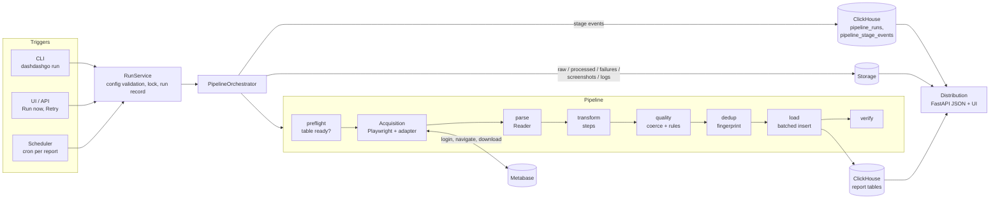

# DashDashGo

**Configuration-driven dashboard report ETL.** DashDashGo logs into a web dashboard
with a real browser (Playwright), finds and downloads a report (CSV, XLSX or JSON),
validates and transforms it, loads it into a report-specific ClickHouse table, and records
everything that happened, so it can be monitored, retried and audited from a web UI or an API.

A new report is a YAML file, not new code.

```
"Here is a dashboard."                      Metabase: Sales / Sales Report / Weekly Sales
"DashDashGo acquires the report."           Chromium logs in, navigates, filters, clicks Download
"It validates and transforms the data."     parse -> transform -> type-coerce -> quality rules
"It loads it into a proper schema."         analytics.sales_metrics  (Date, Decimal, LowCardinality ...)
"It records everything."                    pipeline_runs + per-stage timeline + logs + artifacts
"It handles failures and retries."          classified errors, backoff, screenshots, traces
"It prevents duplicate ingestion."          content fingerprint + ReplacingMergeTree + insert tokens
"It runs manually or on a schedule."        CLI / UI / API / cron - one orchestrator
"I can monitor it."                         http://localhost:8000
"I can add another report."                 reports/<name>.yaml
```

---

## Contents

- [Quick start](#quick-start)
- [What's in the box](#whats-in-the-box)
- [Architecture](#architecture)
- [Project structure](#project-structure)
- [Configuration](#configuration)
- [Adding a new report](#adding-a-new-report)
- [Managing pipelines in the UI](#managing-pipelines-in-the-ui)
- [Command line](#command-line)
- [Running pipelines](#running-pipelines)
- [UI and API](#ui-and-api)
- [Reliability: errors, retries, screenshots, logs](#reliability-errors-retries-screenshots-logs)
- [Idempotency](#idempotency)
- [ClickHouse schema design](#clickhouse-schema-design)
- [Storage](#storage)
- [Security](#security)
- [Testing and CI](#testing-and-ci)
- [Design decisions and trade-offs](#design-decisions-and-trade-offs)
- [Limitations](#limitations)
- [Future improvements](#future-improvements)

---

## Quick start

Requirements: Docker with Compose v2 (about 4 GB RAM free). Python 3 is only needed to
generate `.env` (or copy it by hand).

```bash
git clone <repo> dashdashgo && cd dashdashgo

make env            # .env from .env.example with random secrets  (or: cp .env.example .env)
make up             # = docker compose up --build -d, then waits for health
```

The first start takes about 2–4 minutes: images build, Metabase initialises, and a
one-shot seeder creates the demo dashboards. Then open:

| What | URL |
|---|---|
| DashDashGo UI | http://localhost:8000 (set `APP_PORT` in `.env` if 8000 is taken) |
| API reference (OpenAPI) | http://localhost:8000/docs |
| Demo Metabase | http://localhost:3000 (log in with `METABASE_USERNAME` / `METABASE_PASSWORD` from `.env`) |

Press **Run** next to any pipeline, or from a terminal:

```bash
make run REPORT=weekly_sales        # CSV  -> analytics.sales_metrics
make run REPORT=customer_usage      # XLSX -> analytics.daily_usage
make run REPORT=q4_budget_review    # JSON -> analytics.finance_data
make run REPORT=weekly_sales        # again -> SKIPPED: identical data already loaded
```

`make help` lists every command (`down`, `clean`, `logs`, `test`, `test-e2e`, `lint`, ...).

---

## What's in the box

Eight pipelines run against a local Metabase: the assignment's three scenarios, plus five
more that each exercise something different.

| Pipeline | Dashboard action (Playwright) | Stored as | Processing | Table |
|---|---|---|---|---|
| `weekly_sales` | *Sales* → *Sales Report* dashboard → card menu → Download CSV | `Weekly_Sales.csv` | normalise headers, trim, fix casing, type, validate | `analytics.sales_metrics` |
| `customer_usage` | *Customer Usage* dashboard → **clicks the Usage Date filter → "Previous 7 days"** → Download XLSX | `Customer_Usage_7Day.xlsx` | read sheet, **pivot** long → wide | `analytics.daily_usage` |
| `q4_budget_review` | *Finance Archive* → *Q4 Budget Review* question → Download JSON | `Q4_Budget_Review.json` | parse JSON, **flatten nested objects**, derive variance | `analytics.finance_data` |
| `support_tickets` | *Support Overview* dashboard → **date widget + multi-select Priority widget** (High, Urgent) → CSV | `Support_Tickets_<date>.csv` | nullable CSAT, rule proving the category filter applied | `analytics.support_tickets_daily` |
| `marketing_campaigns` | *Marketing Performance* dashboard, filter via URL, **formatted** CSV export | `Marketing_Campaigns_30Day.csv` | parses `$1,234.56`, `12,345` and `September 14, 2026`; derives CTR and ROAS | `analytics.marketing_campaign_daily` |
| `inventory_snapshot` | *Operations* → *Inventory Snapshot* question → JSON | `Inventory_<date>.json` | drops the report's TOTAL row, flattens supplier JSON, `Bool` reorder flag, **quarantines 2 corrupt rows** | `analytics.inventory_snapshot` |
| `web_traffic_hourly` | *Hourly Web Traffic* question filtered to the last 48 hours → CSV | `Web_Traffic_<date>.csv` | `DateTime` hourly grain; overlapping windows deduplicated | `analytics.web_traffic_hourly` |
| `mrr_monthly` | *Finance Archive* → *SaaS Metrics* dashboard → XLSX | `MRR_Movements_<date>.xlsx` | removes a duplicated export row, derives net new MRR; monthly cron | `analytics.mrr_monthly` |

**Implemented:**

- **Acquisition:** Playwright with no fixed sleeps. Login detects success vs. rejected credentials, and navigation goes by name through collections. Filters are applied by **operating the dashboard's filter widgets** (date shortcuts, the relative-date editor, multi-select category lists) or through URL parameters, and they're verified either way. The download is awaited, validated, and stored under a configurable file name.
- **Formats:** readers for CSV (encoding and BOM handling, delimiter sniffing), XLSX (sheet selection) and JSON (records path, nested objects), behind a strategy interface.
- **Transformation:** 13 declarative transform steps. Type coercion is driven by the ClickHouse schema, row-level quality rules can fail, drop or quarantine bad rows, and duplicate natural keys are rejected.
- **Loading:** report-specific ClickHouse tables are generated from config, schema drift is detected, inserts are batched with per-batch dedup tokens, and every load is verified.
- **Reliability:** a typed error hierarchy classifies each error as retryable or not, with exponential backoff. Failure screenshots, redacted page HTML and optional Playwright traces are captured.
- **Idempotency:** a content fingerprint skips repeat loads, and ReplacingMergeTree handles rows re-delivered in overlapping windows.
- **Run metadata:** a live per-stage timeline, structured per-run logs, and raw, processed and failure artifacts organised by `report/date/run`.
- **Execution:** manual (CLI), on demand (UI/API), retry, and cron scheduling. All four go through the same orchestrator, with a per-report lock.
- **Pipeline management in the UI:** create, edit (live validation, errors mapped to lines), duplicate, version history and restore, and archive, with conflict protection and a guarantee that secrets stay in environment variables.
- **A complete CLI:** everything the UI does, plus per-run overrides (`--set key=value`, `--headed`, `--no-retry`, `--config FILE`).
- **UI and API:** an operations UI (overview, pipeline page, run history, run detail with timeline, screenshots, logs and retry) and a JSON API that serves ingested data as JSON or CSV.
- **Quality gates:** 173 unit tests, 8 ClickHouse integration tests and 18 end-to-end tests, plus `ruff` and `mypy --strict`, all run by GitHub Actions CI.

---

## Architecture



Four layers, each with one job:

| Layer | Responsibility | Knows nothing about |
|---|---|---|
| **Acquisition** (`acquisition/`) | Browser lifecycle, dashboard adapter (login → navigate → filter → download), download validation, screenshots, retries | pandas, ClickHouse |
| **Ingestion** (`ingestion/`) | Readers, transform steps, schema-driven coercion, quality rules, fingerprint | browsers, ClickHouse |
| **Warehouse** (`warehouse/`) | Connection, DDL, drift checks, batched loads, verification, reads | pandas transforms, browsers |
| **Distribution** (`distribution/`) | JSON API + UI over run metadata, artifacts and loaded data | how data was acquired |

The **orchestrator** (`orchestration/pipeline.py`, about 200 lines) only sequences these
services and records each stage. `container.py` is the single composition root: it's the
only place infrastructure objects are constructed, which keeps modules free of global state
and makes every dependency swappable in tests.

### Run lifecycle

```
QUEUED -> RUNNING -> config -> preflight -> acquisition[attempt n: browser, login, navigate, filters, download, validate]
                  -> parse -> transform -> quality -> dedup -> load -> verify -> SUCCESS
                                                           \-> SKIPPED (identical data already loaded)
           any stage fails ------------------------------------------------> FAILED (stage, type, message, evidence)
```

Every stage writes a RUNNING row when it starts and a SUCCESS/FAILED row with duration
and message when it ends. The UI timeline reads those rows directly, so it's live while
the run executes.

---

## Project structure

```
.
├── .github/workflows/ci.yml    # lint + types + unit, ClickHouse integration, Compose e2e
├── reports/                    # one YAML per pipeline (edit here, in the UI or via the CLI)
├── src/dashdashgo/
│   ├── config/                 # typed models, YAML loader (${ENV}, --set overrides), versioned store
│   ├── acquisition/
│   │   ├── adapters/           # DashboardAdapter interface + MetabaseAdapter
│   │   ├── browser.py          # Playwright browser/context lifecycle, tracing
│   │   ├── service.py          # attempts, retries, per-step stages, failure screenshots
│   │   └── validation.py       # "is this really a CSV/XLSX/JSON report?" + SHA-256
│   ├── ingestion/
│   │   ├── readers.py          # CSVReader / XLSXReader / JSONReader (strategy)
│   │   ├── transforms.py       # registry of declarative transform steps
│   │   ├── coercion.py         # ClickHouse-type-driven parsing, per-row errors
│   │   ├── quality.py          # rules, invalid-row policy, natural-key uniqueness
│   │   └── service.py          # parse / transform / validate + dataset fingerprint
│   ├── warehouse/              # ClickHouse client wrapper, DDL, loader, reader
│   ├── metadata/               # run/stage models, ClickHouse repository, RunTracker
│   ├── orchestration/          # PipelineOrchestrator, RunService (locking, background runs)
│   ├── scheduling/             # APScheduler wiring, standard-cron translation
│   ├── storage/                # StorageBackend interface + LocalStorage
│   ├── distribution/           # FastAPI app: api.py, ui.py, templates/, static/
│   ├── observability/          # structured logging, run context, secret redaction
│   ├── columns.py              # the supported ClickHouse type model
│   ├── errors.py               # exception hierarchy (retryable? which stage?)
│   ├── container.py            # composition root
│   └── cli/                    # dashdashgo run | runs | show | logs | retry | data | stats | config ...
├── demo/metabase_seed.py       # creates the demo Metabase content (test environment only)
├── docker/postgres/init/       # demo "upstream warehouse" behind Metabase (test environment only)
├── tests/{unit,integration,e2e}/
├── Dockerfile · docker-compose.yml · Makefile · .env.example
```

---

## Configuration

### Environment (`.env`)

Secrets and infrastructure endpoints only. See `.env.example`, which contains placeholders
only.

| Variable | Purpose |
|---|---|
| `CLICKHOUSE_HOST/PORT/USER/PASSWORD` | Destination warehouse and metadata store |
| `CLICKHOUSE_METADATA_DATABASE` | Database for `pipeline_runs` / `pipeline_stage_events` (default `dashdashgo`) |
| `METABASE_URL/USERNAME/PASSWORD` | Dashboard credentials, referenced from report YAML as `${...}` |
| `POSTGRES_PASSWORD`, `DEMO_READER_PASSWORD` | Demo environment only |
| `LOG_LEVEL`, `LOG_FORMAT` (`text`/`json`) | Logging |
| `SCHEDULER_ENABLED` | Run cron schedules inside the API process |
| `STORAGE_RETENTION_DAYS` | Artifact retention (0 = keep forever) |
| `MAX_CONCURRENT_RUNS` | Background worker threads (default 2) |
| `APP_PORT` | Host port for the UI/API (default 8000) |

### Report config (`reports/<name>.yaml`)

A complete, real example ([`reports/customer_usage.yaml`](reports/customer_usage.yaml)):

```yaml
name: customer_usage                       # must match the file name
description: Daily product usage per account (last 7 days), pivoted to one row per account-day.

source:
  platform: metabase                       # selects the dashboard adapter
  base_url: ${METABASE_URL}                # ${VAR} and ${VAR:-default} are resolved from the environment
  credentials:
    username: ${METABASE_USERNAME}
    password: ${METABASE_PASSWORD}         # SecretStr: masked in logs, UI and API
  location:                                # navigated by name, like a person would
    collection: [Customer Success]
    dashboard: Customer Usage              # or   question: <name>
    card: Daily Customer Usage
  filters:
    usage_date: past7days                  # parameter slug -> value(s), Metabase syntax
    # priority: [High, Urgent]             # several values for a category filter
    # region: {value: EU, label: Sales Region}   # long form: explicit widget label
  filter_mode: auto                        # widget | url | auto (widget, URL fallback)
  export:
    format: xlsx                           # csv | xlsx | json
    formatted: false                       # raw ISO dates / numbers (true = locale formatted)
    filename: Customer_Usage_7Day.xlsx     # stored name; {date} = run date
  # selectors: {...}                       # override UI hooks if a Metabase upgrade changes them

browser:                                   # all optional
  headless: true
  timeout_ms: 30000
  navigation_timeout_ms: 45000
  download_timeout_ms: 120000
  screenshot_on_failure: true
  trace: on_failure                        # off | on_failure | always
  viewport: {width: 1440, height: 900}

ingestion:
  reader: {sheet: Query result}            # encoding, delimiter, sheet, header_row, records_path
  expected_columns: [Usage Date, Account ID, Account, Plan, Metric, Value]   # detects upstream drift
  transforms:
    - normalize_columns
    - rename: {columns: {account: account_name}}
    - pivot: {index: [usage_date, account_id, account_name, plan], columns: metric, values: value}
  quality:
    on_invalid_rows: quarantine            # fail | drop | quarantine
    max_invalid_ratio: 0.05
    rules:
      - {column: account_id, pattern: "ACC-\\d{4}"}
      - {column: plan, allowed: [Starter, Growth, Enterprise]}
      - {column: storage_gb, min: 0}

destination:
  database: analytics
  table: daily_usage
  partition_by: toYYYYMM(usage_date)
  order_by: [usage_date, account_id]       # = natural key (see Idempotency)
  columns:
    - {name: usage_date, type: Date}
    - {name: account_id, type: String}
    - {name: account_name, type: String}
    - {name: plan, type: LowCardinality(String)}
    - {name: active_users, type: UInt32}
    - {name: sessions, type: UInt32}
    - {name: api_calls, type: UInt64}
    - {name: storage_gb, type: Float64}

retry: {max_attempts: 3, initial_delay_seconds: 5, backoff_multiplier: 2, max_delay_seconds: 60}

schedule: {enabled: true, cron: "30 6 * * *", timezone: Asia/Kolkata}
```

**Validation is strict and happens before anything starts.** Unknown keys, missing env
vars, unsupported formats or column types, invalid cron or timezone, unknown transform
steps or options, rules on columns that don't exist, and `order_by` on nullable columns
are all rejected with the location of every problem:

```
$ dashdashgo validate
✗ broken.yaml: invalid configuration
  - source.base_url: Field required
  - retry.max_attempts: Input should be greater than or equal to 1
  - ingestion.transforms.2: unknown transform 'explode'; available: change_case, compute, ...
```

**Transform steps:** `normalize_columns`, `rename`, `drop_columns`, `strip_whitespace`,
`change_case`, `fill_null`, `drop_duplicates`, `filter_rows`, `parse_json`, `flatten`,
`pivot`, `parse_numbers` (for formatted exports such as `$1,234.56`) and `compute`. Type conversion is not a step: it's derived from `destination.columns`.

**Supported column types:** `String`, `FixedString(N)`, `(U)Int8–64`, `Float32/64`,
`Decimal(P,S)`, `Bool`, `Date`, `Date32`, `DateTime[('tz')]`, `DateTime64(p[, 'tz'])`,
optionally wrapped in `Nullable()` and/or `LowCardinality()`.

---

## Adding a new report

No Python changes are needed for a new report on a supported dashboard and format.

1. **Build or locate the report** in the dashboard, and note its collection path, dashboard
   and card (or question) name, and any filter slugs.
2. **Create the config**, whichever way suits you:
   - **UI:** *New pipeline* (blank template or *Copy of* an existing report), or *Duplicate*
     on a pipeline page. The editor validates as you type.
   - **CLI:** `dashdashgo config new <name> --from weekly_sales --edit` (opens `$EDITOR`,
     and re-opens it until the config validates).
   - **File:** add `reports/<name>.yaml` and run `dashdashgo config import reports/<name>.yaml`
     (or just drop the file into the reports directory when running from source).
3. **Describe the destination schema.** Pick real types (`Decimal` for money, `Date` for
   days, `LowCardinality(String)` for low-cardinality categories). Set `order_by` to the
   columns that uniquely identify a row.
4. **Add transforms** until the file's columns match the destination column names, then add
   quality rules for anything you'd want to be alerted about.
5. **Validate and look at the DDL:**

   ```bash
   docker compose exec app dashdashgo validate <name>
   docker compose exec app dashdashgo schema <name>     # the CREATE TABLE it will run
   ```
6. **Run it:** `make run REPORT=<name>`, or press *Run* in the UI. The table is created on
   the first run (`destination.create_table: true`). Configs are re-read on every run, so no
   restart or rebuild is needed. Saving in the UI re-syncs schedules immediately; file edits
   are picked up within 5 minutes.

**Extension points, when configuration is not enough:**

| Need | Add | Registered in |
|---|---|---|
| New file format (TSV, Parquet, XML...) | subclass `ReportReader` | `ingestion/readers.py: READERS` |
| New cleaning step | a function + options model with `@transform("name", Options)` | `ingestion/transforms.py` |
| New dashboard product (Superset, Tableau...) | implement `DashboardAdapter` (prepare, login, open_report, apply_filters, download) + a source model with its own `platform` | `acquisition/adapters/__init__.py: ADAPTERS`, `config/models.py: SourceConfig` |
| New artifact store (S3, GCS) | implement `StorageBackend` | `container.py` |
| New metadata store | implement `RunRepository` | `container.py` |

---

## Managing pipelines in the UI

The UI is a full management surface, not just a viewer: **New pipeline** in the sidebar,
**Edit config** and **Duplicate** on every pipeline page, and **Fix** next to any invalid
config on the overview.

- **Editor:** YAML with line numbers. It validates as you type, using exactly the rules a
  run uses (structure, types, cron, transforms, quality rules, env vars). Every problem is
  listed with its location, and clicking it jumps to the line.
- **Summary before saving:** source path, destination table (and whether it already exists),
  transforms, rules, schedule and the generated DDL.
- **Warnings:** you're told if the edit would *drift an existing table* (runs would fail
  preflight until it's migrated), or if *another pipeline already writes to the same table*.
- **Safe saves:** each save is checked against the version you opened (optimistic
  concurrency, so a stale editor can't overwrite a newer change) and written atomically. The
  previous version goes to `reports/.history/<name>/` and can be loaded back from the
  editor's *History* panel.
- **Archive, not delete:** the file moves to `reports/.archive/`, the schedule is removed,
  and run history stays.
- **Secrets stay out:** any `password` / `token` / `secret` / `api_key` value must be an
  `${ENV_VAR}` reference; a plaintext secret is rejected with a pointer to the line. The
  editor only ever shows raw YAML, which therefore never contains secret values.

In Docker, configs live on the `app-reports` volume at `/data/reports`, which keeps UI/CLI
edits across restarts and rebuilds. Reports shipped with the image (`./reports`) are added
at startup when the volume has never had them. This is add-only: an edited report is never
overwritten, and an archived one is never brought back. `make export-reports` copies the
edited configs back into the repository.

The editor is backed by a small API (`/api/reports/{name}/config`, `.../validate`,
`.../history`, `POST /api/reports`, `DELETE /api/reports/{name}`), so the same operations can
be scripted.

---

## Command line

Everything the UI can do is available from a terminal: locally (`uv run dashdashgo ...`),
in the container (`docker compose exec app dashdashgo ...`), from cron, or in CI.

```text
run      <report> | --config FILE   run now and wait; exit 0 = success/skipped, 1 = failed, 2 = config error
           --set key.path=value     override any config value for this run only (repeatable)
           --headed --no-retry      watch the browser; single attempt
           --timeout SECONDS        browser step timeout
           --force  --json          reload identical data; machine-readable result
runs     [--report R] [--status failed] [--limit N] [--json]
show     <run_id> [--json]          status, timeline incl. per-attempt browser steps, artifacts
logs     <run_id> [--level WARNING] [--follow]
retry    <run_id> [--force]
data     <report> [--since D] [--until D] [--limit N] [--format table|csv|json] [--lineage]
stats    [--days 7]
list | validate [<report>...] [--file FILE] | schema <report>
config   show | edit | new [--from R] [--edit] | import FILE|- [--name] | history | restore | archive
serve    [--host] [--port] [--no-scheduler]
init-db | prune [--days N]
```

```bash
$ dashdashgo run customer_usage --set source.filters.usage_date=past30days --no-retry
✓ SUCCESS  run=20260921-212702-4fed0d  report=customer_usage  duration=6.2 s  downloaded=1200  rejected=0  inserted=300
Details: dashdashgo show 20260921-212702-4fed0d

$ dashdashgo data weekly_sales --limit 2
report_date  region  product             category     orders  units_sold  revenue
-----------  ------  ------------------  -----------  ------  ----------  -------
2026-09-14   East    Aurora Desk Lamp    Home Office      10          10   431.20
2026-09-14   East    Echo Desk Speakers  Audio             2           2   180.18
```

Overrides are applied *before* validation (an invalid value is rejected exactly like a bad
file) and are written to the run's log, so a run's inputs are always traceable. Output is
coloured on a terminal and plain when piped or when `NO_COLOR` is set.

---

## Running pipelines

The same orchestrator runs regardless of how a run is triggered:

| Trigger | How | Recorded as |
|---|---|---|
| Manual | `dashdashgo run <report>` with optional overrides (see [Command line](#command-line)) | `cli` |
| On demand | UI **Run now** / `POST /api/reports/{name}/runs?force=` | `api` |
| Retry | UI **Retry** on a finished run / `POST /api/runs/{id}/retry` | `retry` (linked to the parent run) |
| Scheduled | `schedule.cron` + `schedule.timezone` in the report YAML | `schedule` |

- **Concurrency:** a per-report file lock (`flock`) prevents two runs of the same report from
  overlapping, even across processes (for example a CLI run in one container and a scheduled
  run in another). Different reports run in parallel, up to `MAX_CONCURRENT_RUNS`.
- **Cron semantics:** standard cron, so `1` means Monday. APScheduler 3 numbers days from
  Monday = 0, which would silently shift every weekly schedule by one day. DashDashGo
  translates day numbers to names; this is covered by tests.
- **Missed schedules:** after downtime a schedule runs once (`coalesce`), not once per
  missed slot.
- **Restarts:** when the server restarts, runs it was executing are marked FAILED
  ("interrupted") so nothing stays RUNNING forever.

---

## UI and API

**UI** (`/`), server-rendered and backed entirely by real run data; nothing is mocked:

- **Overview:** runs, success rate, failures, rows loaded and median duration for the last
  7 days. Each pipeline shows its schedule, next run, last status and a strip of recent runs,
  plus a Run button.
- **Pipeline:** the pipeline's stages derived from its config (source → acquire → transform
  → validate → load and distribute), statistics, a run-duration chart, run history, a live
  data preview of the table, the masked configuration and the generated DDL. It has
  **Run now**, **Force reload**, **Edit config** and **Duplicate** buttons.
- **Config editor:** see [Managing pipelines in the UI](#managing-pipelines-in-the-ui).
- **Run detail:** status and error panel, **failure screenshots**, a live **timeline** of
  stages with per-attempt acquisition steps, results (row counts, hashes), artifacts,
  **filterable logs**, and **Retry**. The page refreshes itself while the run is in progress.
- Light and dark themes.

**API** (`/docs` for the OpenAPI UI):

```
GET  /api/health                         liveness + ClickHouse/scheduler status (503 when degraded)
GET  /api/stats?days=7                   aggregate run statistics
GET  /api/reports                        configured reports, schedules, next run, stats
GET  /api/reports/{name}                 masked config, schedule, stats, DDL
POST /api/reports/{name}/runs?force=     start a run -> 202 + run record
GET  /api/reports/{name}/data            loaded rows: ?limit&offset&since&until&run_id&format=json|csv
GET  /api/runs?report=&status=           run history
GET  /api/runs/{run_id}                  run + timeline + artifacts
GET  /api/runs/{run_id}/logs             structured log lines
POST /api/runs/{run_id}/retry            re-run a finished run's report
GET  /api/artifacts/{key}                screenshots, raw files, rejected rows, traces
```

`/api/reports/{name}/data` is the distribution endpoint for downstream consumers. It reads
with `FINAL`, so consumers always see exactly one row per natural key. Decimals are
returned as strings so no monetary precision is lost in transit.

---

## Reliability: errors, retries, screenshots, logs

### Error model

Every error is a subclass of `DashDashGoError` that declares whether a retry could help and
which stage it belongs to:

| Error | Retryable | Typical cause |
|---|---|---|
| `ConfigurationError` | no | invalid YAML, missing env var, unknown filter slug |
| `AuthenticationError` | **no** (avoids account lockout) | dashboard rejected the credentials |
| `ReportNotFoundError` | no | collection/dashboard/card not found; the message lists what *does* exist |
| `NavigationError`, `BrowserError` | yes | page/element timeout, connection refused, browser crash |
| `DownloadError` | yes (no for wrong format) | no download within the timeout, empty file, HTML error page |
| `ReportFormatError`, `SchemaDriftError` | no | unparseable file, expected columns missing |
| `TransformationError`, `DataQualityError` | no | bad data: retrying would give the same result |
| `WarehouseConnectionError`, `LoadError` | yes | ClickHouse unavailable, transient server error |
| `SchemaMismatchError`, `VerificationError` | no | table drifted from config, row count mismatch |

Retries use exponential backoff (`initial_delay × multiplier^(n-1)`, capped) and apply
where they make sense: the whole acquisition attempt (with a fresh browser every time), the
preflight check, and the insert. Unexpected exceptions (bugs) are logged with a traceback
and still mark the run FAILED, so a run never stays RUNNING.

### Playwright robustness

- **No `sleep()`.** Every wait is a locator wait, a URL wait, `expect(...)` or
  `expect_download()`, each with an explicit timeout.
- **Selectors** use form `name`s, `data-testid`s, ARIA roles and exact accessible names,
  not layout CSS. They're configurable per report (`source.selectors`) for Metabase upgrades.
  The Metabase image is pinned (`v0.63.18.1`) so the defaults stay correct.
- **Login** waits for *either* the app shell *or* the form's error alert, so a wrong password
  is recognised in about a second, not after a 30-second timeout.
- **Onboarding modals** that can appear on any page are dismissed automatically by
  `page.add_locator_handler`.
- **SPA races** are handled explicitly. For example, after entering a collection the adapter
  waits until the header shows that collection's name before searching its items.
- **Filters** have three modes (`source.filter_mode`):
  - `widget` operates the dashboard's filter widgets like a person. It clears the widget,
    then either clicks a shortcut such as *Previous 7 days*, uses the *Relative date range*
    editor (interval + unit) for other periods, or ticks the values in a category list
    (searching long lists) and presses *Add filter*.
  - `url` sets the dashboard/question parameters in the URL, which is what Metabase itself
    does when a widget changes.
  - `auto` (the default) tries the widgets and falls back to the URL if one can't be operated.
    Questions have no dashboard widgets, so they use the URL.

  Either way the result is **verified** against the page's parameter state: a mistyped slug
  (Metabase silently drops unknown ones) is a `ConfigurationError`, a value the widget
  doesn't offer is a `ConfigurationError`, and any other active filter (Metabase remembers
  each user's last values) is logged as a warning. The *Apply filters* step records which
  method was used, for example `usage_date=past7days via widget`.
- **Downloads** are validated for existence, non-zero size, the expected format (zip
  structure for XLSX, JSON start, not binary, not an HTML error page), size limits and a
  SHA-256 hash. The file must also parse. A download event alone doesn't count as success.

### Failure evidence

When any browser step fails, DashDashGo stores:

```
screenshots/<report>/<date>/<run_id>/attempt1_login_failure.png     full-page screenshot
failures/<report>/<date>/<run_id>/attempt1_login_failure.html       page DOM (secrets redacted)
failures/<report>/<date>/<run_id>/attempt1_trace.zip                Playwright trace (trace: on_failure)
failures/<report>/<date>/<run_id>/rejected_rows.csv                 quarantined rows with reasons
```

The UI shows screenshots on the run page; clicking one opens an in-page viewer (arrows
between attempts, Esc to close). If the browser never rendered anything (for example when the
dashboard host is unreachable), a blank screenshot would be useless evidence, so DashDashGo
draws a "The page did not load" card with the step, attempt, URLs and error into the
browser and screenshots that instead. Open a trace with
`npx playwright show-trace attempt1_trace.zip`.

### Logs

Every log record is stamped with the run, report and stage it belongs to, so any module can
simply call `log.info(...)`:

```
2026-09-21 18:47:13 INFO    [run=20260921-184709-3fa66f] [report=weekly_sales] [stage=acquisition.download] Downloaded weekly_sales_2026-09-21T18_47_13.csv
2026-09-21 18:47:13 INFO    [run=20260921-184709-3fa66f] [report=weekly_sales] [stage=parse] ✓ parse (0.0s) 280 rows, 7 columns
2026-09-21 18:47:14 INFO    [run=20260921-184709-3fa66f] [report=weekly_sales] [stage=load] ✓ load (0.0s) 280 rows -> analytics.sales_metrics
2026-09-21 18:47:14 INFO    [run=20260921-184709-3fa66f] [report=weekly_sales] SUCCESS - 280 rows loaded into analytics.sales_metrics
```

Each run also gets its own JSON-lines log (`logs/<report>/<date>/<run_id>/run.log`, served
in the UI) and a `run.json` summary that's readable even without ClickHouse. Set
`LOG_FORMAT=json` for JSON on stdout.

**Where a run's logs and artifacts live.** They're written to the storage of the process that
executed the run, while run metadata goes to the shared ClickHouse. A run started inside the
stack (UI, API, scheduler, or `docker compose exec app dashdashgo run`) writes to the app's
volume, and the UI shows everything. A run started from a host terminal (`uv run dashdashgo
run`) writes to that machine's `STORAGE_ROOT`. Each run records `executed_on`
(`host:storage-location`), and if its log isn't in the server's storage, the run page says
where it was written instead of showing an empty panel.

---

## Idempotency

Running the same report twice must never silently duplicate data. DashDashGo uses three
layers, each covering a different failure mode.

**1. Dataset fingerprint (run level).** After validation, DashDashGo computes an
order-independent SHA-256 of the cleaned dataset. If a previous *successful* run of the same
report loaded identical content, the run ends as **SKIPPED** and links to that run; nothing
is inserted. The fingerprint deliberately covers *data*, not file bytes: an XLSX export
embeds timestamps, so two downloads of identical data never have the same file hash. The
file hash is still recorded for audit. Use `--force` or **Force reload** to load anyway.

**2. ReplacingMergeTree on the natural key (row level).** Each table uses
`ENGINE = ReplacingMergeTree(_ingested_at) ORDER BY <natural key>`. When a report is
re-ingested with *partially* overlapping data (`customer_usage` runs daily over a rolling
7-day window, so consecutive runs share 6 days), the newest version of each key replaces
the older one. Reads use `FINAL`, so consumers see one row per key immediately, even before
background merges run. Nothing is deleted by DashDashGo. The quality stage rejects a batch
that contains duplicate keys itself, because ClickHouse would otherwise silently keep an
arbitrary one.

**3. Insert deduplication tokens (retry level).** Each insert batch carries
`insert_deduplication_token = <run_id>:<batch_no>`, with
`non_replicated_deduplication_window` enabled on the table. If an insert times out on the
client after the server has already committed it, the retried batch is discarded by
ClickHouse. Verification then counts rows by `_run_id`, so a partial or doubled load is
caught.

Every row also carries `_run_id`, so any row in any table can be traced to the run, the raw
file and the logs that produced it.

---

## ClickHouse schema design

Each report has its own table and real column types. Nothing is stored as "everything is a
String".

```sql
-- generated by `dashdashgo schema weekly_sales`
CREATE TABLE IF NOT EXISTS `analytics`.`sales_metrics`
(
    `report_date` Date COMMENT 'Day of the sale',
    `region` LowCardinality(String),
    `product` String,
    `category` LowCardinality(String),
    `orders` UInt32,
    `units_sold` UInt32,
    `revenue` Decimal(18, 2) COMMENT 'Net revenue after discounts (USD)',
    `_run_id` String COMMENT 'DashDashGo run that wrote this row',
    `_ingested_at` DateTime64(3, 'UTC') COMMENT 'Row version for ReplacingMergeTree'
)
ENGINE = ReplacingMergeTree(`_ingested_at`)
PARTITION BY toYYYYMM(report_date)
ORDER BY (`report_date`, `region`, `product`)
SETTINGS non_replicated_deduplication_window = 1000
```

- **Types:** `Decimal` for money (no float rounding in sums), `Date` for days, `UInt*` for
  counts, `LowCardinality(String)` for regions, categories and plans, and `Nullable` only
  where absence is meaningful (for example `finance_data.actual_amount` is NULL until actuals
  are booked, which is different from 0).
- **ORDER BY** is the natural key and doubles as the primary index. Time-first ordering suits
  the dominant query ("last N days").
- **PARTITION BY month** for the time-series tables. `finance_data` (tens of rows per
  quarter) is intentionally *not* partitioned, because tiny partitions hurt more than they help.
- **Drift protection:** before each run the live table is compared with the config (missing,
  unexpected or retyped columns). A mismatch fails the run in preflight, before the browser
  starts, with a message telling you to migrate the table or update the config.
- **Metadata tables** (`dashdashgo.pipeline_runs`, `dashdashgo.pipeline_stage_events`) are
  ReplacingMergeTree tables keyed by run (and stage/attempt). Each state change inserts a new
  row version and reads use `FINAL`. This is the idiomatic ClickHouse way to model
  "UPDATE"-style state at small volume, and it keeps the stack to a single database.

---

## Storage

`StorageBackend` is a small interface (`put_file`, `put_bytes`, `read_bytes`, `list`,
`writer`, `prune`). `LocalStorage` backs it with a Docker volume. Keys are partitioned by
area, report, date and run:

```
storage/
├── raw/<report>/<date>/<run_id>/<downloaded file>       exactly what the dashboard returned
├── processed/<report>/<date>/<run_id>/data.parquet      typed, validated rows that were loaded
├── failures/<report>/<date>/<run_id>/                   rejected_rows.csv, page HTML, traces
├── screenshots/<report>/<date>/<run_id>/                failure screenshots
└── logs/<report>/<date>/<run_id>/run.log, run.json
```

Keys are validated against path traversal, writes are atomic (temp file + rename), and
retention (`STORAGE_RETENTION_DAYS`) prunes whole date partitions daily (`dashdashgo prune`).
An S3 backend would implement the same six methods. `writer()` exists so that files produced
incrementally (the run log) can be uploaded when they close.

---

## Security

- **No secrets in code or YAML.** Configs reference `${ENV_VAR}`; `.env` is git-ignored,
  and `.env.example` contains placeholders only. `make env` generates random secrets.
- **Passwords are `SecretStr`**, rendered as `**********` in the UI, API responses and
  `repr`.
- **Log redaction:** every registered secret (dashboard passwords, the ClickHouse password)
  is masked in every log message and traceback before any handler writes it.
- **Failure evidence is scrubbed.** Captured page HTML is redacted. Playwright tracing
  starts only *after* login, because traces record typed values (including passwords) in
  plain text.
- **Artifacts** are served from a whitelist of areas with traversal-safe keys. Captured
  HTML is served as `text/plain` with `nosniff`, so it can never execute in the app's origin.
- **Containers:** the app runs as a non-root user, ports are bound to `127.0.0.1`, and
  Metabase queries the demo warehouse through a read-only role.

---

## Testing and CI

A step-by-step **manual test script**, with the expected result for every feature and failure
mode, is in [docs/MANUAL_TESTING.md](docs/MANUAL_TESTING.md).

```bash
make test              # unit tests (173): no infrastructure needed, about 3 s
make test-integration  # Python <-> ClickHouse (8): needs the stack running
make test-e2e          # Metabase -> Playwright -> ClickHouse (18), inside the app container
make test-all          # everything, inside the app container
make lint              # ruff check + ruff format --check + mypy --strict
```

| Suite | Covers |
|---|---|
| **unit** | config validation (18 invalid cases, env interpolation), readers (BOM, delimiters, sheets, nested JSON, malformed input), every transform, type coercion (ranges, decimals, dates, time zones, nulls), quality policies, fingerprinting, retry and backoff classification, storage and traversal safety, log redaction and per-run log isolation, download validation, the orchestrator end to end with fakes (success, skip, force, retry, failure, bugs), **real headless-Chromium acquisition** with a scripted adapter (retry + screenshot, no retry on auth failure), runner locking, scheduler wiring and cron semantics, API and UI rendering, config store (versioning, conflicts, history, secret guard), config API, CLI commands and `--set` overrides |
| **integration** | table creation and drift detection, typed round trip, ReplacingMergeTree + `FINAL`, insert-token dedup, metadata repository, restart recovery |
| **e2e** | all eight pipelines against the seeded Metabase; filters really set through the widgets (date + multi-select), relative periods without a shortcut, a value the widget doesn't offer, raw files stored under configured names; cleaning verified on real exports; duplicate run → SKIPPED; wrong password → 1 attempt, screenshot, no secret in artifacts; missing dashboard → not retried; unknown filter slug → ConfigurationError; unreachable dashboard → retried, then FAILED |

E2E tests write to a throwaway ClickHouse database and storage directory and drop them
afterwards.

**CI** (`.github/workflows/ci.yml`) runs on every push and pull request:

| Job | What |
|---|---|
| `quality` | ruff, format check, `mypy --strict`, validates the shipped configs, unit tests with Playwright Chromium installed (so the real-browser tests run) |
| `integration` | the ClickHouse integration suite against a `clickhouse-server:25.8` service container |
| `e2e` | `docker compose up --build` exactly as an evaluator would, waits for health, runs the e2e suite inside the app container, smoke-tests the CLI and API, and dumps service logs on failure |

---

## Design decisions and trade-offs

| Decision | Why | Trade-off |
|---|---|---|
| **One YAML per report, validated by Pydantic** | Adding a report is data, not code; typos fail in milliseconds with a precise location | The transform DSL is intentionally small; complex logic needs a new registered step |
| **Destination schema declared in YAML, DDL generated** | One source of truth drives coercion, validation, DDL and drift checks | Schema changes need a manual `ALTER TABLE` (no automatic migrations) |
| **Everything is `object` dtype until coercion** | pandas type inference drops leading zeros, turns ints into floats and behaves differently per format. Parsing once, from the schema, is predictable | Slower than vectorised parsing for very large files (fine for report-sized data) |
| **Filters via URL parameters, then verified** | Robust across Metabase releases, unlike date-picker widgets | Relies on Metabase's documented parameter URLs; UI widget interaction isn't exercised |
| **Browser download instead of Metabase's export API** | The assignment is about browser automation, and the same approach works for dashboards that have no API | Slower and more fragile than an API call; mitigated by stable selectors, pinning and tests |
| **Metadata in ClickHouse** | No extra database; the monitoring data lives next to the data it describes | ReplacingMergeTree + `FINAL` instead of real updates; fine at metadata scale |
| **Scheduler in the API process, per-report `flock`** | Simple, one container, same code path as manual runs | One scheduler instance; horizontal scaling needs an external scheduler or queue |
| **Server-rendered UI (Jinja + a little vanilla JS)** | No build chain, no CDN, one language, fast to review | Less interactive than an SPA; live updates use polling |
| **Config editing = raw YAML, validated live** | One representation for files, UI, CLI and review; the full config surface is available without a form for every option | Users edit YAML rather than fill a form; the live validation and line-mapped errors make up most of the difference |
| **Configs on a Docker volume** | UI/CLI edits persist and the non-root app user can write them on any host OS | Edits live in the volume, not the git checkout; `make export-reports` brings them back |
| **Postgres behind the demo Metabase** | Metabase's own app DB plus a small upstream warehouse whose data is generated *relative to today*, so "last week" and "last 7 days" always have data and re-downloads are byte-stable | One extra container, used only by the demo environment |
| **`python:3.12-slim` + Chromium only** | Only the browser actually used; runs as non-root | Image is still about 2.9 GB (Chromium + its system libraries + pandas/pyarrow) |

---

## Limitations

These are known limitations, not hidden ones:

- **One dashboard adapter (Metabase).** The interface is ready for others, but none are
  implemented. Selector defaults target the pinned Metabase version.
- **Authentication** is username/password. SSO, MFA and TOTP aren't supported, though the
  adapter is the natural place to add them.
- **Single-node execution.** Runs execute in a thread pool inside one process. The report
  lock works across processes on one host (a shared volume), not across hosts.
- **No authentication on the UI/API.** Ports are bound to localhost; put it behind SSO or a
  reverse proxy before exposing it.
- **Schema evolution** is detected, not automated; `ALTER TABLE` is manual.
- **Whole-file processing in memory.** This is fine for dashboard exports (up to around
  millions of rows). Streaming or chunked parsing would be needed for bigger files.
- **Retention prunes files, not ClickHouse rows or run metadata.**
- **Local storage only**; S3 is an interface away, not implemented.
- **Config history is file-based** (`reports/.history`), per instance, and not tied to a
  user. With UI authentication, saves could record who changed what.

---

## Future improvements

- S3/GCS `StorageBackend`, and ClickHouse TTLs for run metadata.
- More adapters (Superset, Looker, Tableau), plus SSO/MFA login strategies.
- A distributed execution model (queue + workers such as Celery/RQ/Arq) with a database-backed
  lock.
- Alerting on failures (Slack/email/webhooks) and Prometheus metrics.
- A "dry run" mode (download + transform + validate, no load) from the editor.
- Authenticated UI/API with per-user audit of config changes.
- Schema migrations generated from config diffs.
- AI-assisted recovery: when a selector breaks, use an LLM or vision agent (for example
  browser-use) to propose an updated selector from the failure screenshot and DOM, and have
  a human confirm it.
